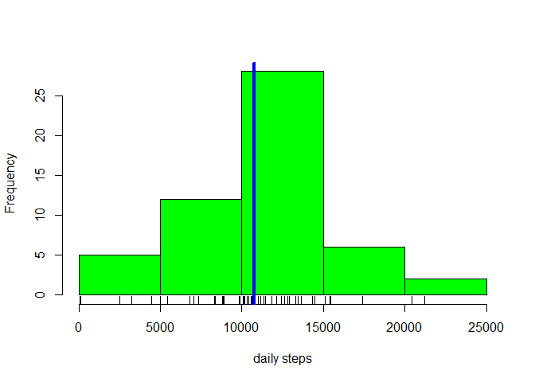
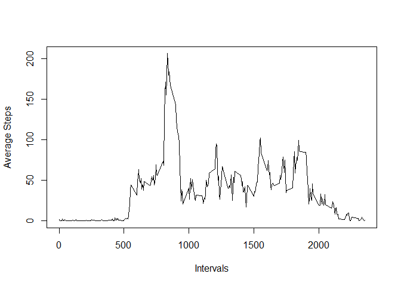
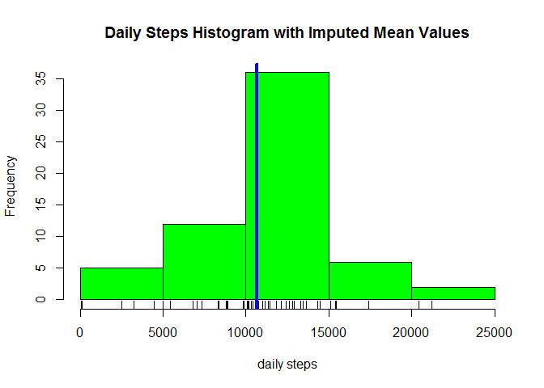
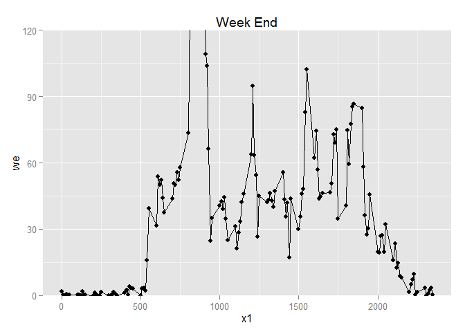
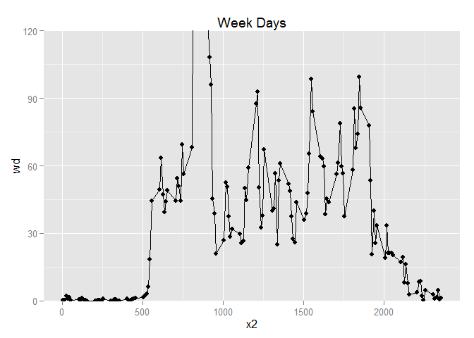

# Reproducible Research: Peer Assessment 1


```r
library(dplyr)
library(data.table)
```

## Loading and preprocessing the data


```r
if (!file.exists("Data/activity.zip")) {
    url <- "https://d396qusza40orc.cloudfront.net/repdata%2Fdata%2Factivity.zip"
    zfile="Data/activity.zip"
    download.file(url, zfile)
    unzip(zipfile=zfile, exdir="Data")
}
```


```r
df <- read.csv("Data/Activity.csv")
df <- mutate(df, id = rownames(df))
```


Ignore Missing Values

```r
noNA <- na.omit(df)
```


##  What is the mean total number of steps taken per day?

```r
noNA <- data.table(noNA, key="date")
dailySteps <- noNA [,sum(steps), by=key(noNA)]
setnames(dailySteps, "V1", "steps")
summary(dailySteps)
```

```
##          date        steps      
##  2012-10-02: 1   Min.   :   41  
##  2012-10-03: 1   1st Qu.: 8841  
##  2012-10-04: 1   Median :10765  
##  2012-10-05: 1   Mean   :10766  
##  2012-10-06: 1   3rd Qu.:13294  
##  2012-10-07: 1   Max.   :21194  
##  (Other)   :47
```


```r
hist(dailySteps$steps, col="green", 
      main="", xlab="daily steps")
rug(dailySteps$steps)
abline(v=median(dailySteps$steps), lwd=4, col="blue")
```

 


## What is the average daily activity pattern?


```r
vy <- tapply(noNA$steps, noNA$interval, mean)
vx <- as.integer(names(vy))

plot(vx, vy, type="l", xlab="Intervals", 
     ylab="Average Steps", 
     main="")
```

 


The 5-minute interval that has the maximum number of steps


```r
z <- as.data.frame(vy)
vy[which(z$vy == max(z$vy))]
```

```
##      835 
## 206.1698
```


## Imputing missing values
The toal number of missing values in the dataset. (rows with NA)

```r
nrow(subset(df, is.na(steps) ==TRUE))
```

```
## [1] 2304
```


Fill missing data with imputed mean values 

```r
library(Hmisc)
df.i <- with(df, impute(steps, mean))
df$impmean <- as.integer(df.i)
```


There is a little difference in mean and median values.

```r
dt <- data.table(df, key="date")
ds <- dt[,sum(impmean), by=key(dt)]
setnames(ds, "V1", "impmean")
summary(ds)
```

```
##          date       impmean     
##  2012-10-01: 1   Min.   :   41  
##  2012-10-02: 1   1st Qu.: 9819  
##  2012-10-03: 1   Median :10656  
##  2012-10-04: 1   Mean   :10752  
##  2012-10-05: 1   3rd Qu.:12811  
##  2012-10-06: 1   Max.   :21194  
##  (Other)   :55
```


It appears there is little impact of imputing missing data on the estimates of the total daily number of steps.

```r
# png(file="Figures/plot3.png", width=480, height=480)
hist(ds$impmean, col="green",  
     main="Daily Steps Histogram with Imputed Mean Values", xlab="daily steps")
rug(ds$impmean)
abline(v=median(ds$impmean), lwd=4, col="blue")
```

 

```r
# dev.off()
```


## Are there differences in activity patterns between weekdays and weekends?


```r
df$isweekend <- weekdays(as.Date(df$date)) %in% c("Saturday", "Sunday")
df$isweekend <- factor(c(TRUE,FALSE))

s <- split(df,df$isweekend)
wkend <-s$'TRUE' %>% filter(!is.na(steps))
wkday <- s$'FALSE' %>% filter(!is.na(steps))

library(ggplot2)
we <- tapply(wkend$steps, wkend$interval, mean)
wd <- tapply(wkday$steps, wkday$interval, mean)

x1 <- as.numeric(names(we))
x2 <- as.numeric(names(wd))
g1 <- qplot(x1,we, aes(x=interal, y=steps) )
g2 <- qplot(x2,wd, aes(x=interal, y=steps) )

g1 + geom_line()  + coord_cartesian(ylim=c(0,120))  + labs(title="Week End")
```

 


```r
g2 + geom_line()  + coord_cartesian(ylim=c(0,120))  + labs(title="Week Days")
```

 


